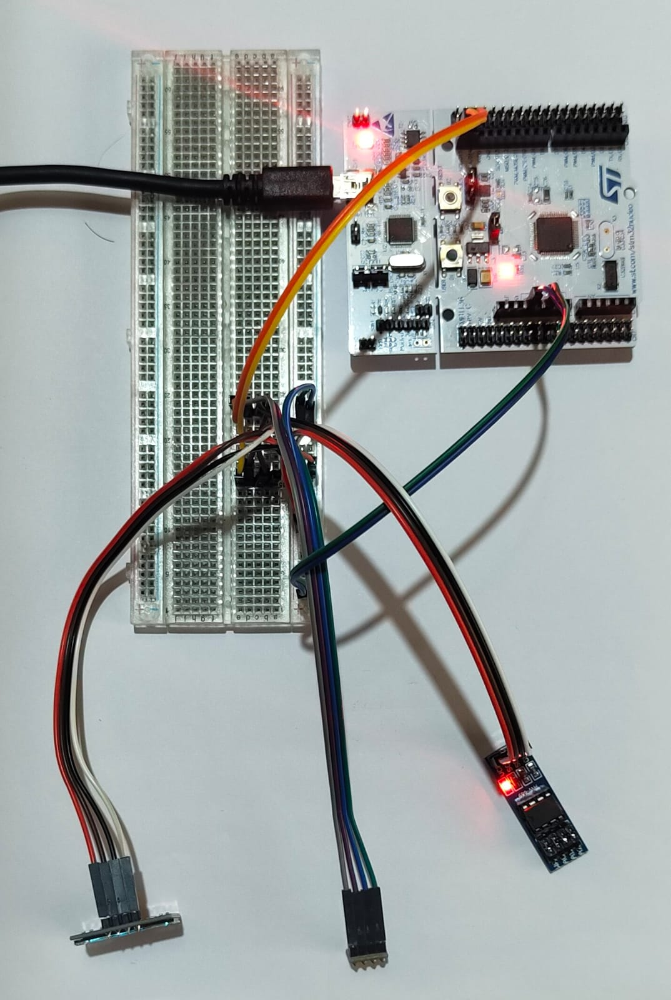
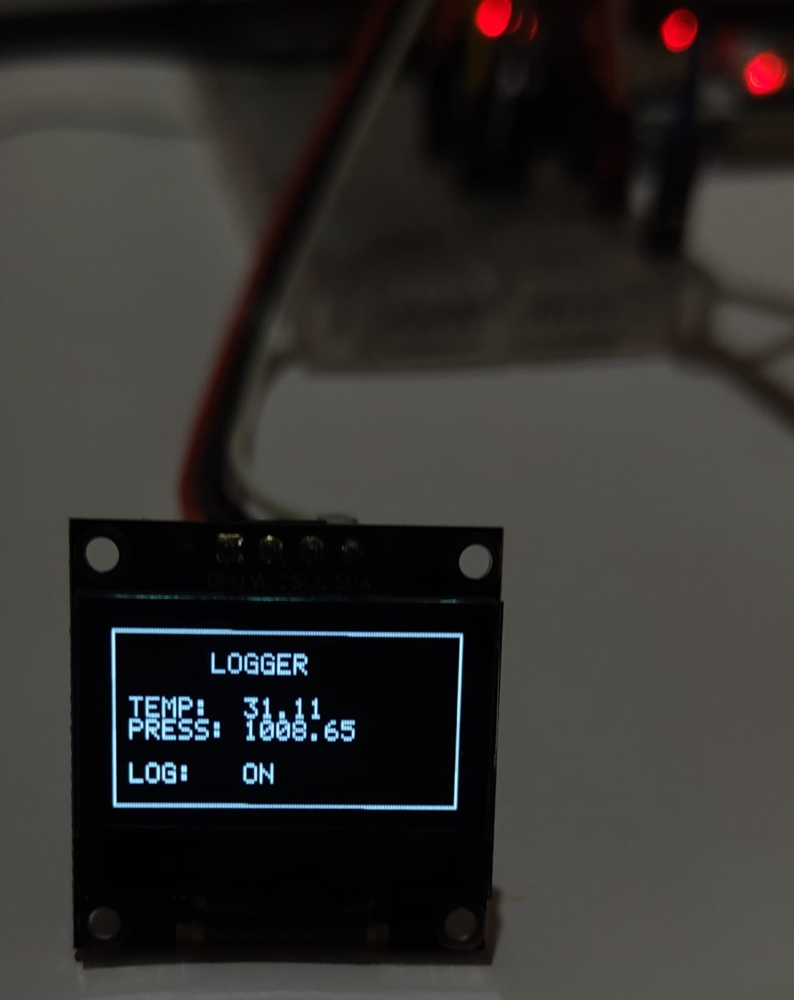
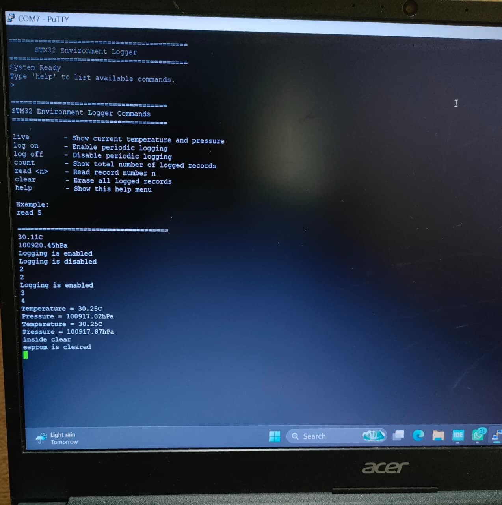

# STM32 Environment Logger

An STM32 bare-metal environment logger that periodically reads temperature and pressure from a BMP280 sensor, stores measurements in an external AT24C256 EEPROM, displays live readings on an SSD1306 OLED, and provides a UART command-line interface for monitoring and controlling the logger.

## Hardware Used

- STM32 Nucleo-F446RE
- BMP280 Temperature/Pressure Sensor
- SSD1306 OLED Display (128x64)
- AT24C256 EEPROM

## Features

- Bare-metal firmware (No HAL)
- BMP280 temperature measurement
- BMP280 pressure measurement
- SSD1306 OLED display
- External EEPROM data logging
- UART command-line interface
- Interrupt-driven UART reception using a ring buffer
- Fixed-point sensor data storage
- 5-second timer interrupt
- Modular layered software architecture
- Custom I2C driver
- Custom EEPROM driver
- Custom BMP280 driver
- Custom SSD1306 driver

## Build Environment

- STM32CubeIDE
- STM32F446RE
- Bare-metal drivers (No HAL)

## Software Architecture
Application
|
|-- Environment Logger
|-- UART Command Console

BSP
|-- BMP280
|-- EEPROM
|-- SSD1306
|-- Fonts
|-- Logger

Drivers
|-- RCC
|-- GPIO
|-- USART
|-- Ring Buffer
|-- I2C
|-- TIM
|-- NVIC
|-- SysTick
|-- Delay

### Drivers

- CMSIS
- GPIO
- RCC
- SYSTICK
- DELAY
- I2C
- TIM
- NVIC
- UART

### BSP

- BMP280
- EEPROM
- FONTS
- LOGGER
- SSD1306

### Application

- Environment Logger
- UART Command Console

## UART Commands

| Command  | Description                           |
|----------|---------------------------------------|
| help     | Display available commands            |
| live     | Show current temperature and pressure |
| log on   | Enable periodic logging               |
| log off  | Disable periodic logging              |
| count    | Display total logged records          |
| read n   | Read the nth EEPROM record            |
| clear    | Erase all logged records              |

## Current Operation

1. Timer generates a 5-second interrupt.
2. BMP280 temperature and pressure are sampled.
3. Logging is performed if logging is enabled.
4. Latest readings are displayed on the OLED.
5. UART commands can be used to:
   - View live readings
   - Enable/disable logging
   - Read stored records
   - Display record count
   - Erase logged data

## Future Improvements

## Future Improvements

- Circular buffer logging
- RTC timestamp support
- SD card logging
- CSV export over UART
- Non-blocking EEPROM erase
- Configuration commands

Project Status
--------------
Current Version: v2.0

Implemented

- BMP280 Driver
- SSD1306 Driver
- EEPROM Driver
- UART Driver
- Ring Buffer
- UART Command Console
- Timer Interrupt Logging
- EEPROM Data Logging
- Fixed-point UART output

## Skills Demonstrated

- Embedded C
- Bare-metal STM32 Programming
- CMSIS Register Programming
- Interrupt Handling
- Ring Buffer Implementation
- UART Communication
- I2C Communication
- EEPROM Memory Management
- Sensor Driver Development
- Modular Firmware Architecture

## Demo

### Hardware Setup

### OLED Output

### UART Command Console

## Author

Leo Raju